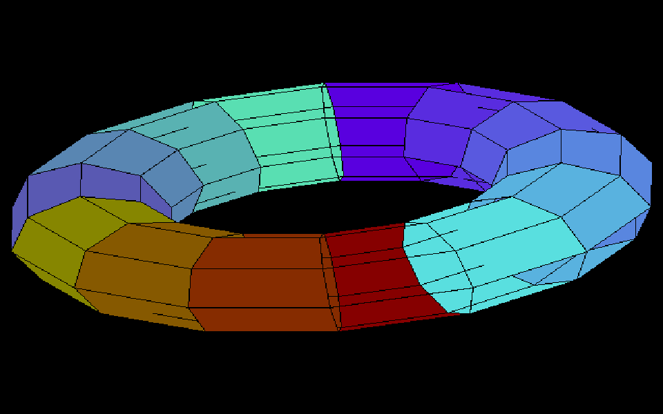
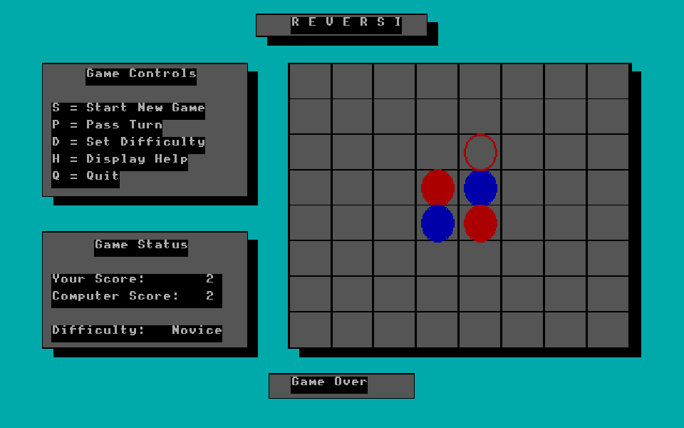
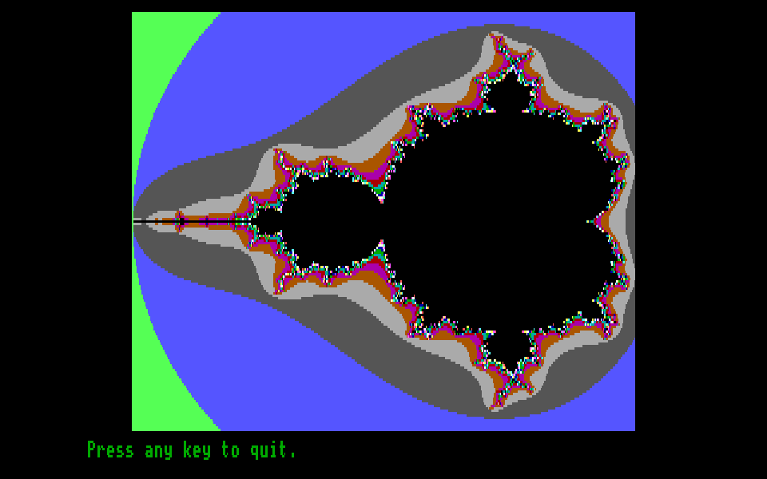
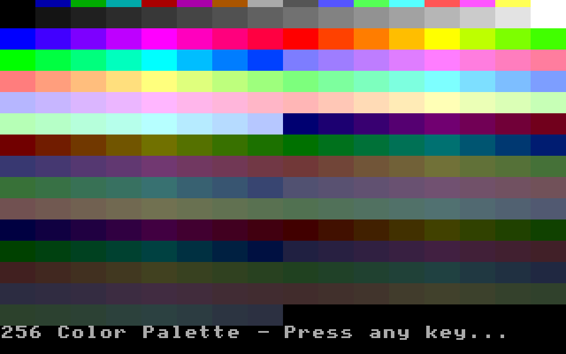
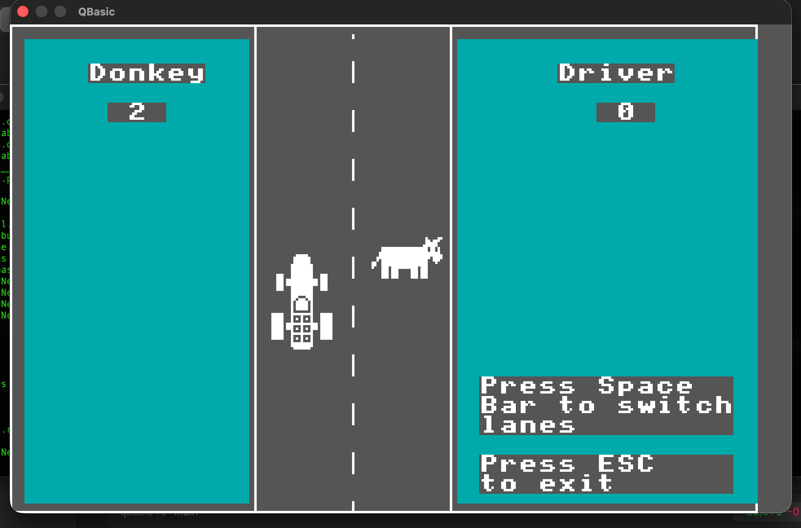

# qbasic_rs

A transpiler that converts QBasic `.bas` source files into native Rust binaries.

The primary correctness target is **GORILLAS.BAS** — the classic gorilla-throwing game shipped with MS-DOS QBasic — running at full fidelity with graphics, sound, and game logic intact.

---

## Screenshots

Native binaries, captured headless via the runtime's `QBC_DUMP` driver (see
[Headless driver](#headless-driver-debugging--testing)).

<table>
<tr>
<td align="center"><br><b>torus.bas</b> — interactive 3D torus (SCREEN 12, VGA DAC palette)</td>
<td align="center"><br><b>reversi.bas</b> — Reversi/Othello with an AI opponent (SCREEN 9)</td>
</tr>
<tr>
<td align="center"><br><b>mandel.bas</b> — Mandelbrot renderer (VIEW/WINDOW, PALETTE cycling)</td>
<td align="center"><br><b>256c.bas</b> — 256-color VGA palette (SCREEN 13)</td>
</tr>
<tr>
<td align="center"><br><b>donkey.bas</b> — IBM PC Donkey (CGA SCREEN 1, DRAW sprites, GOTO state machine)</td>
</tr>
</table>

---

## What it does

```
gorilla.bas  →  [qbc transpiler]  →  gorilla.rs  →  [rustc]  →  gorilla
```

The transpiler (`qbc`) reads a QBasic source file, walks the AST, and emits a self-contained Rust source file that links against a small runtime library. The result is a native binary with no QBasic interpreter involved at runtime.

---

## Quick start

```bash
# Build everything
cargo build

# Transpile and run gorillas
cargo run -- basic-src/gorilla.bas -o bin/gorilla.rs
rustc bin/gorilla.rs --edition 2021 \
  -L target/debug/deps \
  --extern qbasic_runtime=target/debug/libqbasic_runtime.rlib \
  -o bin/gorilla
bin/gorilla

# Or just inspect the emitted Rust
cargo run -- basic-src/gorilla.bas --emit-only
```

---

## Supported programs

| Program | Description | Status |
|---------|-------------|--------|
| `gorilla.bas` | Classic gorilla-throwing game (SCREEN 9 EGA, CIRCLE/PAINT/GET/PUT sprites, PLAY audio) — [walkthrough](gorillas.md) | ✅ |
| `torus.bas` | Interactive 3-D torus (arrays of TYPE, WINDOW/PMAP, VGA DAC palette cycling) — [walkthrough](torus.md) | ✅ |
| `reversi.bas` | Reversi/Othello with an AI opponent (2-D TYPE array, 3-D array, WINDOW SCREEN, ERASE) — [walkthrough](reversi.md) | ✅ |
| `mandel.bas` | Mandelbrot renderer (VIEW/WINDOW coords, PALETTE cycling, PACE) | ✅ |
| `donkey.bas` | Q-BASIC Donkey game (GOTO state machine, DRAW sprites, CGA SCREEN 1) — [walkthrough](donkey.md) | ✅ |
| `sortdemo.bas` | Animated sorting visualizer (SHARED vars, animation) | ✅ |
| `money.bas` | Money manager (DATA/READ, SELECT CASE, arrays) | ✅ |
| `pi.bas` | Arbitrary-precision pi via Machin's formula | ✅ |
| `hangman.bas` | Hangman word game (modern QBasic style, DO/LOOP, named GOSUB/GOTO) | ✅ |
| `hangman-gw.bas` | Hangman word game (GW-BASIC style, line numbers, GOTO state machine) | ✅ |
| `sound.bas` | Minimal PLAY/MML demo (text-mode, audible arpeggio) | ✅ |
| `screen13.bas` | SCREEN 13 (MCGA 320×200, 256-color VGA DAC palette) demo | ✅ |
| `screen13-sprite.bas` | SCREEN 13 GET/PUT sprites (8-bpp MCGA chunky layout) | ✅ |
| `kitchen_sink-gw.bas` | GW-BASIC "mega test" — menu loop, ON GOTO/GOSUB, DEF FN, RESTORE | ✅ |
| `evil.bas` | GW-BASIC "self-modifying POKE matrix" — physical line continuations, POKE/PEEK memory | ✅ |
| `pokeit.bas` | Minimal POKE→PEEK→PRINT regression test | ✅ |
| `demo1.bas` | SCREEN 13 demoscene-style intro — star field, sine-wave scroller | ✅ |

Highlights shown above; **31 of 32 bundled programs** in `basic-src/` transpile and
run (`bash basic-src/build-all.sh` → 31/32; `kitchen_sink-qbasic` is the one
remaining failure). The full set also adds `nibbles`, `donkey`, `q_sort`,
`fuzzbuzz`, `step`, `256c`, `palette256_expanded`, `random-pixel`, `qblocks`,
`loopyloop`, `pixel-gw`, and the `pi-gw`/`hangman-gw` GW-BASIC variants.

---

## Features

### Language coverage
- **Control flow**: IF/ELSEIF/ELSE, FOR/NEXT, WHILE/WEND, DO/LOOP, SELECT CASE (incl. ranges), GOTO, GOSUB/RETURN, ON…GOTO/GOSUB (computed branch)
- **Subroutines**: SUB/END SUB, FUNCTION/END FUNCTION, GOSUB/RETURN, STATIC locals (persist across calls). Parameters pass by reference (QB semantics), including TYPE records.
- **Data**: DIM, REDIM, ERASE, DIM SHARED, COMMON SHARED, DATA/READ/RESTORE, CONST, user-defined TYPE (nested, fixed-length strings), 1-D/2-D/3-D arrays incl. arrays of TYPE
- **Graphics**: SCREEN (0,1,2,7,8,9,10,12,13), LINE, CIRCLE, PAINT, PSET, PRESET, DRAW, GET, PUT (all action verbs), VIEW, WINDOW (+ WINDOW SCREEN), PMAP, POINT, PALETTE, STEP coordinates
- **Sound**: PLAY (full MML parser), SOUND, BEEP — wired to `rodio`
- **I/O**: PRINT, PRINT USING, INPUT, LOCATE, COLOR, CLS, INKEY$, random-access files (OPEN/GET/PUT/CLOSE) with TYPE-record serialization
- **Memory**: POKE (simulated byte store via `HashMap<u32, u8>`), PEEK (reads back stored byte or 0), DEF SEG (parsed/ignored)

### GOTO → state machine
Line-numbered BASIC programs that use GOTO are compiled to a `match __pc { ... }` state machine, with each line number becoming a match arm. Programs that use only GOSUB get clean named Rust functions instead.

### GW-BASIC physical line continuation
A logical GW-BASIC line may wrap across multiple physical file lines — any physical line that doesn't begin with a line number is treated as a continuation of the previous logical line. The lexer detects line-numbered mode automatically and suppresses `Newline` tokens at continuation boundaries. Non-line-numbered programs are byte-identical.

### REM QBC pragmas
Embed transpiler directives anywhere in a `.bas` source file:

```basic
REM QBC FULLSPEED
REM QBC FPS 30
REM QBC PACE 30
REM QBC SLOWMO 2
REM QBC TITLE My Cool Game
REM QBC SCALE 2
```

| Directive | Example | Effect |
|-----------|---------|--------|
| `FULLSPEED` | `REM QBC FULLSPEED` | Disables the frame-rate throttle; program runs at full native CPU speed. Best for computation-heavy programs (pi.bas). |
| `FPS N` | `REM QBC FPS 30` | Cap animation at N frames per second instead of the default 60. |
| `PACE N` | `REM QBC PACE 30` | Sleep-pace the *computation* to N blits/sec so an otherwise-instant native draw is watchable (it sweeps in roughly source-draw order). Unlike `FPS`/`FULLSPEED` (which only skip blits), `PACE` blocks. Used by `mandel.bas`. |
| `SLOWMO N` | `REM QBC SLOWMO 3` | Multiply every QB `SLEEP` duration by N — handy for slow-motion inspection of timed animations. |
| `TITLE text` | `REM QBC TITLE Gorilla Wars` | Set the window title bar text. Default is `QBasic`. |
| `SCALE N` | `REM QBC SCALE 2` | Multiply the output window size by N (default 960×600 → 1920×1200 for N=2). Useful on HiDPI displays. |

Directives are case-insensitive. Multiple directives combine freely.

---

## Headless driver (debugging & testing)

Any transpiled binary honors a set of `QBC_*` environment variables that run it
**without a window** — scripted input, a deterministic RNG, a framebuffer image
dump, and a guaranteed auto-exit. The emitted binary is unchanged; behavior only
differs when these are set. This makes a graphics program debuggable and
testable on a headless box (CI, SSH) with no code edits.

```bash
# Render torus deterministically, dump the frame, print stats, exit after 5 blits
QBC_HEADLESS=1 QBC_SEED=1 QBC_KEYS=ENTER QBC_FBSTATS=1 \
  QBC_DUMP=/tmp/torus.ppm QBC_EXIT_AFTER=presents:5 ./bin/torus
```

| Variable | Effect |
|----------|--------|
| `QBC_HEADLESS=1` | Run with no window. |
| `QBC_KEYS="DOWN,DOWN,ENTER,Q"` | Scripted keystrokes (one per `INKEY$`/`INPUT$`). Names: `UP/DOWN/LEFT/RIGHT/ENTER/ESC/SPACE/TAB/F1…`, plus single chars. Maps identically to real keypresses. |
| `QBC_SEED=N` | Pin the RNG (overrides `RANDOMIZE TIMER`) so RND-using renders are reproducible. |
| `QBC_DUMP=path.ppm` | Write the framebuffer as a binary PPM image (native resolution). Convert to PNG with `tools/ppm2png.py`. |
| `QBC_TEXT_FB=1` | Render text into the framebuffer (score panels, labels, titles) instead of stdout — for full-screen screenshots. Off by default so the golden tests stay graphics-only. |
| `QBC_DUMP_AT=exit\|present:N\|ms:T` | When to dump (default `exit`). |
| `QBC_CHECKSUM=1` | Print `QBC_CHECKSUM=<hex>` (framebuffer fingerprint) on exit. |
| `QBC_FBSTATS=1` | Print non-background pixel count + distinct colors on exit. |
| `QBC_EXIT_AFTER=idle\|ms:T\|presents:N` | Guaranteed termination (default `idle` + a 10 s safety cap), so a scripted run never hangs on input. |

### Graphics golden tests
`tests/run-graphics-tests.sh` runs each graphics program headless with a fixed
seed and key script, then compares its framebuffer checksum against a committed
golden in `tests/golden/<name>.txt` — regression coverage for rendering that the
stdout-based suite can't provide. On a mismatch it writes `<name>.actual.ppm` for
visual inspection. Regenerate goldens after an intended change with
`--write-golden`.

---

## Project layout

```
qbasic-rust/
├── src/                   # Transpiler (qbc binary)
│   ├── lexer.rs           # Source text → tokens
│   ├── parser.rs          # Tokens → AST
│   ├── analyzer.rs        # AST → symbol table + AnalyzedProgram
│   └── emitter.rs         # AnalyzedProgram → Rust source  (~5370 lines)
│
├── runtime/src/
│   ├── lib.rs             # Runtime struct, graphics, I/O, math  (~3875 lines)
│   └── sound.rs           # PLAY/SOUND/BEEP via rodio  (~300 lines)
│
└── basic-src/             # .bas source files
```

See [ARCHITECTURE.md](ARCHITECTURE.md) for a full description of the pipeline, design decisions, and runtime internals.

---

## CLI

```
qbc <INPUT> [-o OUTPUT] [--emit-only] [--dump-ast] [--verbose]
```

| Flag | Effect |
|------|--------|
| `-o <file>` | Output `.rs` path |
| `--emit-only` | Write `.rs` only; skip rustc |
| `--dump-ast` | Print the parsed AST and exit |
| `--verbose` | Print per-stage timing and stats |

`qbc` auto-locates the runtime rlib relative to its own executable, so `cargo run` works without manual `-L` flags.

---

## Dependencies

| Crate | Used for |
|-------|----------|
| `minifb` | Window creation and pixel buffer display |
| `crossterm` | Terminal input (non-blocking key read) |
| `rodio` | Audio playback for PLAY/SOUND/BEEP |

---

## Design notes

- **All numerics are `f64`** — QB SINGLE precision is widened for simplicity
- **QB-accurate integer math** — `CINT` uses banker's rounding (ties to even); `\` (integer divide) and `MOD` round both operands to integers first, matching QuickBASIC rather than Rust's native operators
- **QB booleans**: `0.0` = false, `-1.0` = true (bitwise NOT convention)
- **Palette-indexed framebuffer** — `POINT(x,y)` returns a palette index, enabling QB-style collision detection
- **SHARED variables** → `GameState` struct passed as `&mut __gs` to every SUB
- **Arrays of TYPE** → flattened to one parallel `Vec` per field (`gg(r,c).player` → `gg__player[r][c]`); N-D arrays nest `Vec<Vec<…>>`
- **GOSUB targets** → named Rust `fn` (clean path, covers all of gorilla.bas)
- **GOTO** → `match __pc` state machine (fallback for line-numbered programs)
- **Coordinate systems** — `WINDOW` (Cartesian, Y-up) vs `WINDOW SCREEN` (screen Y-down); both map a logical rect onto the VIEW/screen with `POINT`/`PMAP` round-tripping
